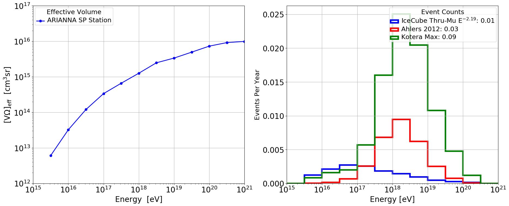

# event_counts
Code to integrate effective volumes against flux models and get counts

You can use it like: `python compute_counts.py veff_file.csv`.

The effective volume file should be in units of cm^3 * sr,
and energies in units of log10(eV) with one header line.
You can see an example by running `python compute_counts.py sample_veff.csv`, which produces the following plot:

